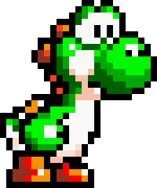

# @cnakazawa/palette-swap

Image palette swapping and color replacement tool based on canvas for Node.js and browsers to create variants from a base image.




## install

```
npm install @cnakazawa/palette-swap canvas
```

## Usage

### `paletteSwap()`

Here is an example of how to use `paletteSwap()` to create two variants from a base image:

```js
import { loadImage } from 'canvas';
import { writeFileSync } from 'node:fs';
import paletteSwap from 'paletteSwap';

const results = paletteSwap(
  await loadImage('./Yoshi.png'),
  new Map([
    [
      2,
      new Map([
        ['#006000', '#570061'],
        ['#00a800', '#8c00a8'],
        ['#00f800', '#de00f8'],
      ]),
    ],
    [3, 220],
  ]),
  new Set([
    '#000000',
    '#903020',
    '#f84020',
    '#f89000',
    '#ff0000',
    '#f8c0a8',
    '#f8e0d0',
    '#f8f8f8',
  ]),
);

for (const [variant, canvas] of results) {
  writeFileSync(`./Yoshi-${variant}.png`, canvas.toBuffer());
}
```

### Parameters

### `image: Image`

The base image that is used for generating each variant.

### `variants: ReadonlyMap<VariantName, ReadonlyMap<HEX, Variant> | Hue>`

The color definitions for each variant. You can either provide a list of mappings for each color, a hue for all colors or a hue for individual colors:

```js
const variantMap = new Map([
  // Map each color to another hex value.
  [
    'Variant',
    new Map([
      ['#ff0000', '#00ff00'],
      ['#ffff00', '#0000ff'],
    ]),
  ],
  // Change the hue of each color.
  ['Variant2', 130],
  // Change the hue of specific colors to specific values.
  [
    'Variant3',
    new Map([
      ['#ff0000', 130],
      ['#0000ff', 15],
    ]),
  ],
]);
```

#### `staticColors?: Set<HEX>`

A `Set` with a list of HEX values (for example `#000000`) to lock certain colors to the same values. Colors in this set will not be replaced when generating variants. For example when you are palette swapping an image of a car you might want to change the color of the chassis but not the color of the tires and the outline. If this parameter is omitted it will copy any colors from the base image that are not explicitly listed in the variants definition.

## `images?: ReadonlyMap<VariantName, Image>`

If you want to avoid returning variants for images that have not changed, you can add an optional `images` parameter with the current image for each variant. If the image hasn't changed, the variant will not be returned in the results.

```js
// Optionally you can provide existing variants
const results = paletteSwap(
  await loadImage('MyImage.png'),
  new Map([
    [2, new Map([])],
    [3, 130],
  ]),
  null,
  new Map([
    [2, await loadImage('MyImage-2.png')],
    [3, await loadImage('MyImage-3.png')],
  ]),
);
```

#### `options?: { imageName?: string; ignoreMissing?: boolean; }`

By default `paletteSwap` will throw an error for any missing color mapping. Options can be specified to ignore missing color mappings or to provide an image name used for the error message when a color mapping is missing.
